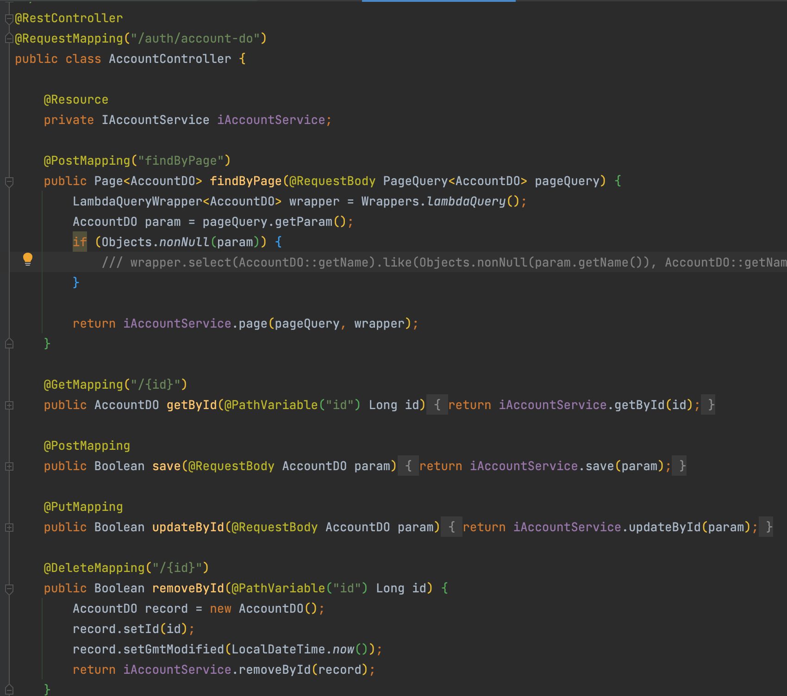
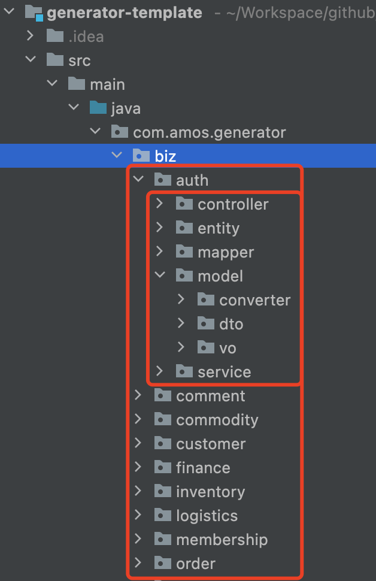
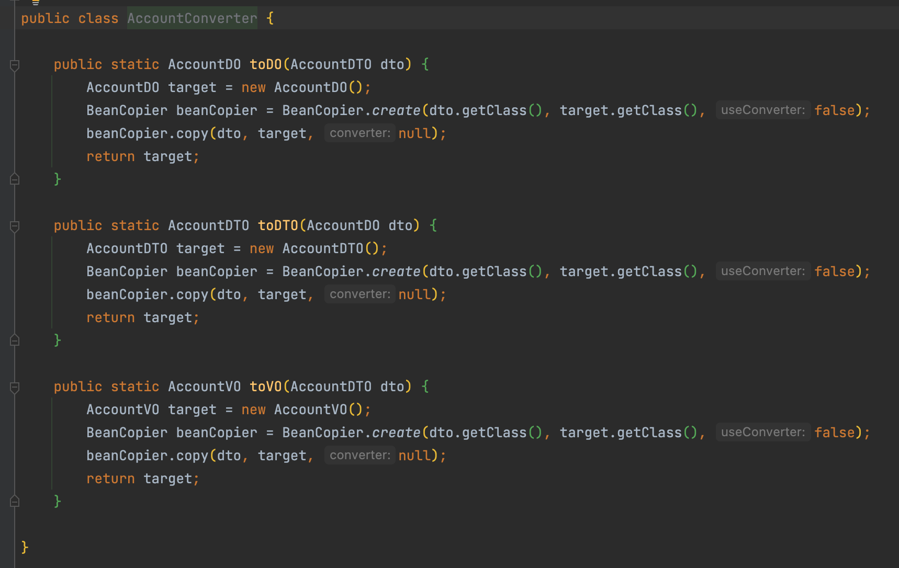

# Java代码生成器-模板项目

> 基于 mybatis-plus-generator 生成自定义模板代码。

## 主要实现的功能：

1. 生成controller层代码（生成了，用不到的类，例如中间表，还是要删掉的，删总比写快哈）
2. 生成dto、vo、converter（用来处理dto --> do, do --> dto, dto --> vo）
3. 根据表名前缀批量生成分包后的业务代码 @see `BatchGeneratorTests`

### 示例:

#### 生成的Controller代码

#### 根据表名前缀批量生成并分包

#### 生成的Converter代码

## 所有功能

- service
- mapper
- entity
- mapper.xml
- model
    - converter
    - dto
    - vo
- controller
    - findByPage
    - getById
    - save
    - updateById
    - removeById

## Quick Start

> 流水式代码，随便看看～

1. com.amos.generator.BaseGeneratorTests 最基础的生成代码
2. com.amos.generator.custom.CustomModelTests 加入dto/vo/converter
3. com.amos.generator.custom.BatchGeneratorTests 根据表名前缀批量生成分包代码

## 写这个模板项目的初衷

最近学习电商项目呢，因为业务比较复杂，一堆增删改查，但又少不了。与其花费大量时间在这种没意义的代码上，不如直接根据表把相关增删改查实现了，在这个基础上，学习业务，学习优秀的设计。

对比下 mybatis-generator-maven-plugin，简单说，mybatis-generator-maven-plugin比较原生，但是生成的代码质量着实一般。 即使 generatorConfig.xml
里边配置了不少东西，生成的代码还是很繁杂，格式也很糟。

这样看来，mybatis-plus-generator简直是神器。

自定义模板挺方便的，但是加参数有些麻烦。